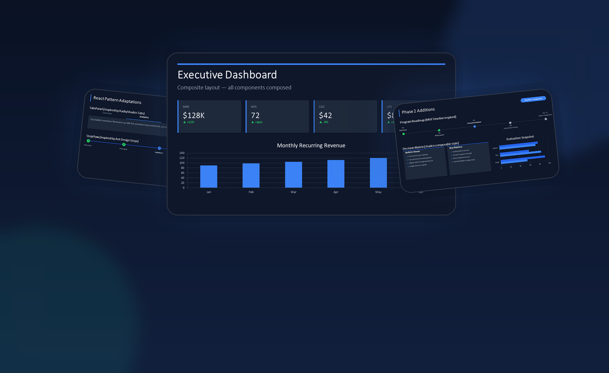
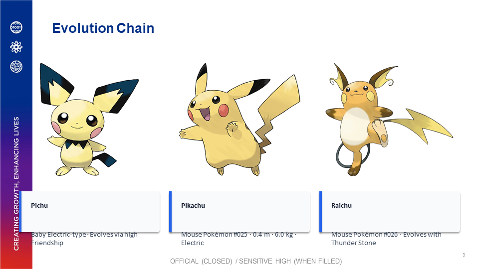
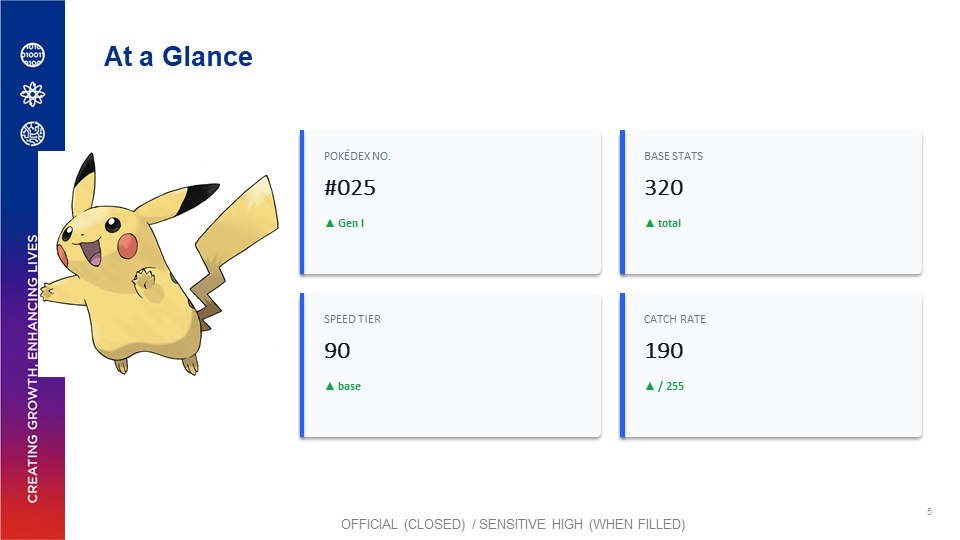
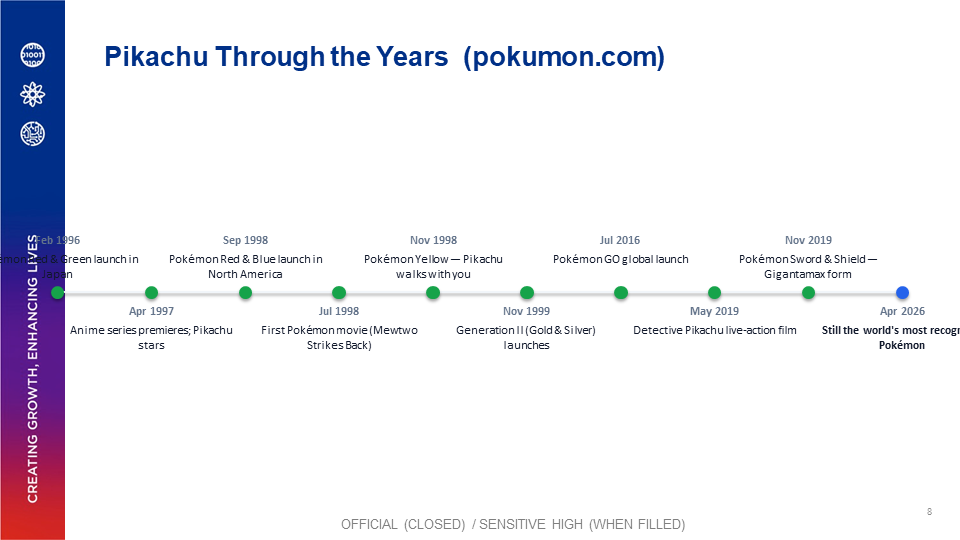

# PowerpointComponents

Composable Python primitives for building modern PowerPoint decks with `python-pptx`.

This project provides a component system (cards, charts, tables, lists, callouts, navigation patterns, media blocks) plus a `SlideBuilder` cursor API so slides can be assembled quickly without hard-coding every coordinate.



## Features

- Theme system with `DarkTheme` and `LightTheme`
- Fluent slide composition with `SlideBuilder`
- Reusable UI components (title, metrics, tables, charts, lists, callouts, progress, navigation)
- New dashboard primitives: `ImageBlock`, `Legend`, `KPIGrid`
- Windows PowerPoint COM export utility for PPTX -> PNG

## Snapshot Gallery

Representative slides from the demo deck, exported to PNG and composed for GitHub-friendly previewing.


## Install

```bash
python -m venv .venv
.venv\Scripts\activate
python -m pip install -r requirements.txt
```

## Quick Start

```python
from pptx import Presentation
import pptx_components as pc

prs = Presentation()
pc.set_theme(pc.DarkTheme())

b = pc.SlideBuilder(prs)
b.add(pc.TitleBlock("Q2 Business Review", "Revenue, growth, and risks"))
b.skip(0.15)
b.add_row(
    pc.MetricCard("Revenue", "$1.28M", delta="+18%", delta_positive=True),
    pc.MetricCard("Active Users", "24,370", delta="+7%", delta_positive=True),
    pc.MetricCard("Churn", "3.2%", delta="+0.4pp", delta_positive=False),
    h=1.5,
)

prs.save("quickstart.pptx")
```

## Slide Master Demo

Use any existing `.pptx` brand template as the slide master. `MasterPresentation`
strips the content slides, preserves all brand chrome (logos, colour bars, layouts,
footers) and lets you build each new slide with `pptx_components` data components.

```python
from pptx_components.master_builder import MasterPresentation
import pptx_components as pc

prs = MasterPresentation("brand_template.pptx", clear_slides=True)

slide = prs.add_slide("3_Title and Content", placeholders={0: "Base Stats"})
slide.set_cursor(1.35).add(
    pc.BarChart(
        categories=["HP", "Attack", "Defense", "Sp. Atk", "Sp. Def", "Speed"],
        series={"Base Value": [35, 55, 40, 50, 50, 90]},
        mode="bar_clustered",
    ),
    h=3.2,
)

prs.save("output.pptx")
```

Run the full 9-slide Pikachu species profile demo:

```bash
python examples/slidemasterdemo/slidemasterdemo.py --export
```

<div align="center">

| Cover | Evolution Chain |
|:---:|:---:|
|  |  |

| KPI Grid | Timeline |
|:---:|:---:|
|  |  |

</div>

See [docs/components/slide_master.md](docs/components/slide_master.md) for the full API reference and walkthrough.

## Run The Demo Deck

```bash
python examples/demo.py
```

This generates:

- `examples/demo_dark.pptx`
- `examples/demo_light.pptx`

## Export Slides To PNG (Windows)

```bash
python pptx_components/export.py examples/demo_dark.pptx --dpi 150
```

Programmatic usage:

```python
from pptx_components import export_slides

paths = export_slides("examples/demo_dark.pptx", dpi=150)
print(paths)
```

## API Surface

Top-level imports are re-exported from `pptx_components`:

### Core

- `Theme`, `DarkTheme`, `LightTheme`, `set_theme`, `get_theme`
- `Component`
- `Row`, `Column`, `Grid`, `Container`
- `SlideBuilder`

### Content Components

- `TitleBlock`, `SectionHeader`
- `MetricCard`, `BigStat`
- `DataTable`
- `BarChart`, `LineChart`, `PieChart`
- `ListBlock`
- `CalloutBox`, `QuoteBlock`
- `Divider`, `Spacer`
- `ProgressBar`, `StatusBadge`
- `TabsPanel`, `StepFlow`
- `ImageBlock`, `Legend`, `KPIGrid`

## Component Examples

### Navigation Patterns

```python
b.add(
    pc.TabsPanel(
        ["Overview", "Analytics", "Risks", "Decisions"],
        active_index=1,
        title="Quarterly Review",
        variant="line",
        content="Revenue is trending above plan in all regions.",
    ),
    h=1.9,
)

b.add(
    pc.StepFlow(
        ["Discovery", "Prototype", "Validation", "Launch", "Scale"],
        current=2,
        statuses=["done", "done", "current", "pending", "pending"],
    ),
    h=1.4,
)
```

### Visual Dashboard Blocks

```python
legend_items = [
    ("APAC", (59, 130, 246)),
    ("EMEA", (16, 185, 129)),
    ("Americas", (249, 115, 22)),
]

b.add_row(
    pc.ImageBlock("examples/demo_dark_slides/slide_004.png", mode="contain"),
    pc.Legend(legend_items, title="Region Colors"),
    h=2.6,
    weights=[1.6, 1.0],
)

b.add(
    pc.KPIGrid(
        [
            ("New Leads", "1,284", "+9%", True),
            ("Conversion", "14.2%", "+1.1pp", True),
            ("Win Rate", "31%", "-2pp", False),
        ],
        cols=3,
    ),
    h=2.0,
)
```

## Project Layout

```text
pptx_components/
  base.py
  layout.py
  slide_builder.py
  theme.py
  export.py
  components/
examples/
  demo.py
```

## Component Docs

- `docs/components/README.md`
- `docs/components/REFERENCE.md`
- `docs/components/PATTERNS.md`

## Notes

- Slide export uses Microsoft PowerPoint COM automation and is Windows-only.
- On non-Windows platforms, you can convert decks with LibreOffice headless workflows.
