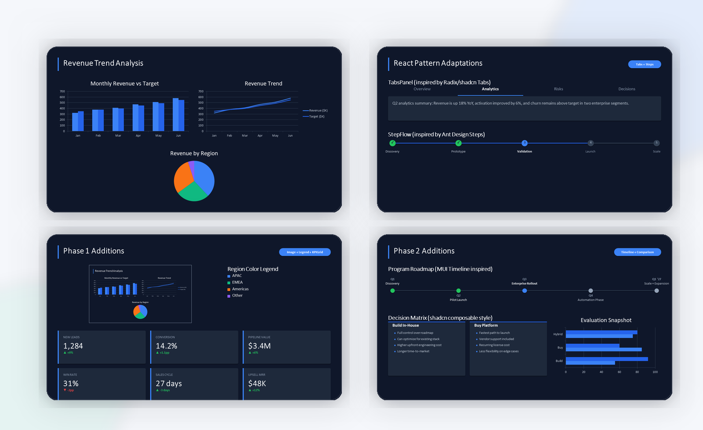
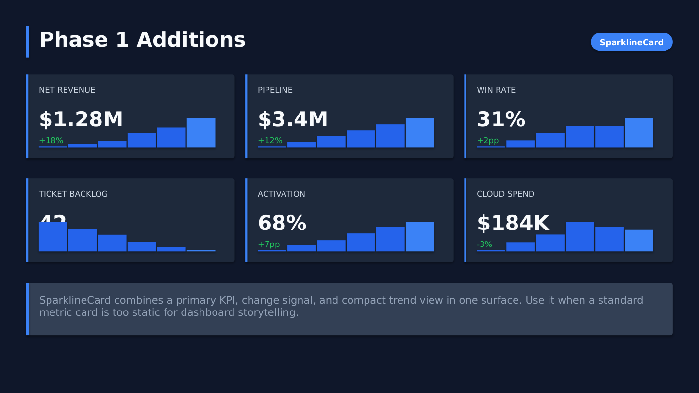
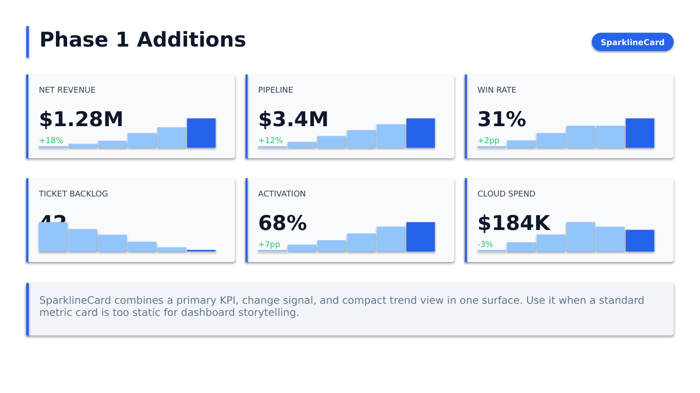

# PowerPoint Components

Build presentation slides with reusable Python components and a builder-style layout flow.

<div class="hero-strip">
	<div class="hero-card">
		<h3>Design-System Feel</h3>
		<p>Reusable components with predictable spacing, hierarchy, and theme tokens.</p>
	</div>
	<div class="hero-card">
		<h3>API-First Docs</h3>
		<p>Function signatures and class docs rendered directly from source with mkdocstrings.</p>
	</div>
	<div class="hero-card">
		<h3>Visual Validation</h3>
		<p>Dark and light slide previews included so docs stay practical for presentation work.</p>
	</div>
</div>

## Why this docs site

- Component-level API reference generated directly from code.
- Searchable docs for quick discovery.
- Practical examples tuned for presentation design workflows.

## Start Here

- Browse [Text Box](components/text_box.md) for text-focused components.
- Browse [Chart](components/chart.md) for chart and data-visualization APIs.
- Browse [Visual Gallery](components/visual_gallery.md) for dark/light output examples.
- Use [Component Reference](components/REFERENCE.md) for a broad manual lookup.

## Install

```bash
python -m venv .venv
.venv\Scripts\activate
python -m pip install -r requirements.txt
```

## Local Docs Preview

```bash
mkdocs serve
```

Open http://127.0.0.1:8000

## Visual Example



## Dark And Light Preview

<div class="shot-grid">
	<figure>
		
		<figcaption>Dark theme: timeline, comparison cards, and chart composition.</figcaption>
	</figure>
	<figure>
		
		<figcaption>Light theme: same composition with a neutral presentation surface.</figcaption>
	</figure>
</div>
